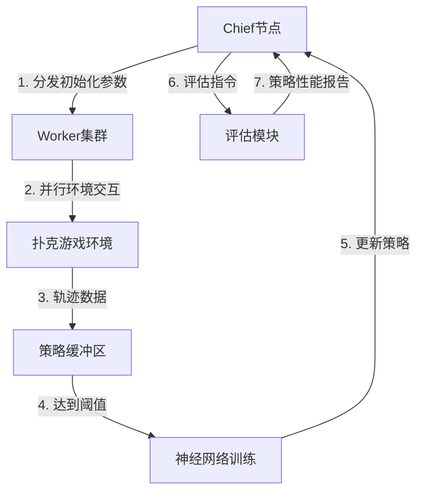
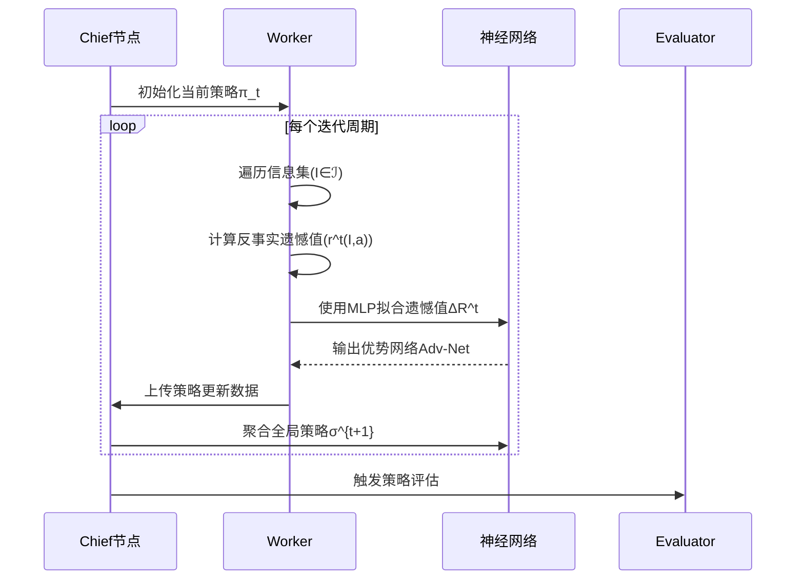
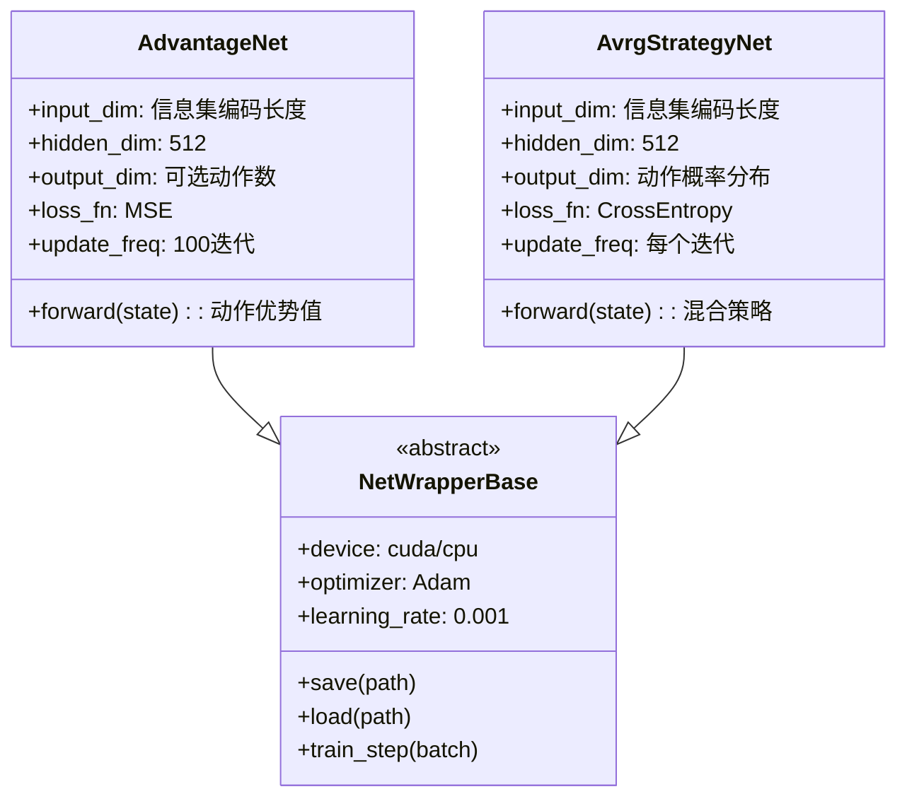

# Deep-CFR 项目架构说明

## 核心流程解析

### 1. 分布式训练架构


### 2. Deep CFR 算法流程


### 3. 策略迭代机制
```mermaid
graph LR
    A[当前策略π_t] --> B[数据采集阶段]
    B --> C{缓冲区状态}
    C -->|未满| D[继续游戏对局]
    C -->|已满| E[策略优化阶段]
    E --> F[训练Advantage网络]
    E --> G[更新Avrg策略网络]
    F --> H[生成新策略π_{t+1}]
    G --> H
    H --> I[评估收敛条件]
    I -->|未收敛| A
    I -->|收敛| J[输出最终策略]
```

## 关键组件说明

### 策略缓冲区 (StrategyBuffer)
- 双缓冲设计：
  - `AdvReservoirBuffer` (DeepCFR/workers/la/buffers/AdvReservoirBuffer.py)
  - `AvrgReservoirBuffer` (DeepCFR/workers/la/buffers/AvrgReservoirBuffer.py)
  - 基于Reservoir采样算法实现，采样率=0.25
- 容量管理：
  - `buffer_size_threshold=1e6` 触发训练
  - `max_buffer_size=2e6` 最大容量
  - 自动淘汰旧样本策略：FIFO + 随机替换
- 数据存储结构：
  ```python
  {
      'info_set': tensor,  # 信息集特征编码
      'action_dist': tensor,  # 动作分布(πσ)
      'regret': tensor,  # 即时反事实遗憾值
      'iteration': int  # 采集迭代次数
  }
  ```

### 神经网络架构


**训练参数配置：**
- 优化器: Adam (β1=0.9, β2=0.999)
- 学习率衰减: 每1000迭代衰减10%
- 正则化:
  - L2 λ=0.01
  - 梯度裁剪: 最大值5.0
- 批大小:
  - 策略网络: 4096
  - 优势网络: 2048
- 激活函数:
  - LeakyReLU (α=0.2)
  - 输出层: Softmax(策略网络)/Linear(优势网络)
- 训练周期:
  - 预训练: 100迭代
  - 主训练: 5000-10000迭代
- 设备分配:
  - 数据采集: CPU
  - 网络训练: GPU (CUDA)

## 实验配置流程
```mermaid
journey
    title 实验执行流程
    section 初始化阶段
      加载配置(paper_experiment_*.py) → 创建游戏实例(games.py) → 初始化神经网络(neural/) → 分配计算资源(dist.py)
    section 训练阶段
      启动Chief节点(chief/) → 激活Worker集群(workers/) → 开始迭代训练(IterationStrategy) → 监控缓冲区状态(StrategyBuffer)
    section 评估阶段
      定期触发BR评估(eval/br/) → 执行H2H对战测试(eval/head_to_head/) → 生成exploitability曲线(analyze_*.py)
      评估指标：
      - 策略漏洞度(Exploitability):
        * 计算公式: ε = ∑_{I∈ℐ} [max_a R^T(I,a) - ∑_{a∈A} π_σ(a|I)R^T(I,a)]
        * 计算频率: 每100迭代
        * 实现模块: analyze_sdcfr_vs_dcfr_strategy.py
      - 胜率矩阵:
        * 对战轮次: 1000局/H2H测试
        * 统计维度: 胜率/弃牌率/加注率
      - 训练稳定性:
        * 优势网络MSE损失波动范围: ±0.05
        * 策略网络交叉熵损失下降率: ≥5%/100迭代
      - 计算效率:
        * 数据采集: ≥5000样本/秒
        * 网络训练: ≥200批次/秒
    section 终止条件
      达到最大迭代次数(n_iters) → 策略性能收敛(exploitability_threshold) → 保存最终模型(trained_agents/)

```

## 性能监控 (`performance_monitor`)

```python
def performance_monitor():
    """
    监控系统性能

    返回:
        dict: 性能指标
    """
    metrics = {
        'cpu_usage': psutil.cpu_percent(),
        'memory_usage': psutil.virtual_memory().percent,
        'gpu_usage': None
    }

    # 如果有CUDA设备，也监控GPU使用情况
    if torch.cuda.is_available():
        metrics['gpu_usage'] = {
            'memory_allocated': torch.cuda.memory_allocated() / (1024**3),  # GB
            'memory_reserved': torch.cuda.memory_reserved() / (1024**3),    # GB
            'utilization': torch.cuda.utilization()                         # 百分比
        }

    return metrics
```
```python
def preprocess_batch(samples, device='cuda'):
    """
    高效预处理样本批次

    参数:
        samples (list): 样本列表
        device (str): 计算设备

    返回:
        tuple: 预处理后的张量
    """
    states = torch.tensor([s[0] for s in samples], dtype=torch.float32).to(device)
    actions = torch.tensor([s[1] for s in samples], dtype=torch.int64).to(device)
    values = torch.tensor([s[2] for s in samples], dtype=torch.float32).to(device)

    return states, actions, values
```

## 数据采集与训练流程详细说明

### 1. 数据采集流程

#### 1.1 外部遗憾网络数据采集 (`collect_advantage_samples`)

```python
def collect_advantage_samples(env, traverser_pid, n_traversals=1000):
    """
    收集优势网络的训练样本

    参数:
        env (PokerEnv): 扑克环境实例
        traverser_pid (int): 当前玩家ID
        n_traversals (int): 遍历次数

    返回:
        list: 样本列表，每个样本包含 (info_state, action, advantage)
    """
    samples = []
    for _ in range(n_traversals):
        samples.extend(_traverse_game_tree(env, traverser_pid))
    return samples
```

#### 1.2 游戏树遍历 (`_traverse_game_tree`)

```python
def _traverse_game_tree(env, traverser_pid, reach_prob=1.0):
    """
    遍历游戏树收集样本

    参数:
        env (PokerEnv): 扑克环境实例
        traverser_pid (int): 当前玩家ID
        reach_prob (float): 到达概率

    返回:
        list: 当前子树的样本
    """
    # 复制当前环境状态
    state = env.state_dict()

    if env.is_terminal():
        # 终止状态返回空样本
        return []

    current_player = env.current_player.seat_id

    # 如果是机会节点（发牌）
    if current_player == env.CHANCE_PLAYER:
        action = env.get_random_action()
        env.step(action)
        samples = _traverse_game_tree(env, traverser_pid, reach_prob)
        env.load_state_dict(state)  # 恢复状态
        return samples

    info_state = env.get_current_obs(is_terminal=False)
    legal_actions = env.get_legal_actions()

    # 如果当前玩家是我们关注的玩家
    if current_player == traverser_pid:
        advantages = _calculate_advantages(env, info_state, legal_actions)
        samples = []

        for action in legal_actions:
            env.step(action)
            child_samples = _traverse_game_tree(env, traverser_pid, reach_prob)
            samples.append((info_state, action, advantages[action]))
            samples.extend(child_samples)
            env.load_state_dict(state)  # 恢复状态

        return samples
    else:
        # 对手玩家使用当前策略
        strategy = _get_strategy(env, info_state, legal_actions)
        samples = []

        for action in legal_actions:
            action_prob = strategy[action]
            if action_prob > 0:
                env.step(action)
                child_samples = _traverse_game_tree(env, traverser_pid, reach_prob * action_prob)
                samples.extend(child_samples)
                env.load_state_dict(state)  # 恢复状态

        return samples
```

#### 1.3 计算优势值 (`_calculate_advantages`)

```python
def _calculate_advantages(env, info_state, legal_actions):
    """
    计算每个动作的优势值

    参数:
        env (PokerEnv): 扑克环境实例
        info_state (np.ndarray): 信息状态向量
        legal_actions (list): 合法动作列表

    返回:
        dict: 每个动作的优势值映射
    """
    advantages = {}
    current_cfr_iter = env.get_current_iteration()

    for action in legal_actions:
        # 获取当前状态下采取此动作的反事实遗憾
        advantages[action] = _compute_counterfactual_regret(env, info_state, action, current_cfr_iter)

    return advantages
```

#### 1.4 策略网络数据采集 (`collect_strategy_samples`)

```python
def collect_strategy_samples(env, player_pid, adv_net, n_traversals=1000):
    """
    收集策略网络的训练样本

    参数:
        env (PokerEnv): 扑克环境实例
        player_pid (int): 玩家ID
        adv_net (AdvantageNetwork): 优势网络
        n_traversals (int): 遍历次数

    返回:
        list: 策略样本列表，每个样本包含 (info_state, strategy)
    """
    samples = []
    for _ in range(n_traversals):
        samples.extend(_collect_strategy_for_player(env, player_pid, adv_net))
    return samples
```

#### 1.5 并行数据采集 (`collect_samples_parallel`)

```python
def collect_samples_parallel(n_workers=8, samples_per_worker=1000):
    """
    并行收集样本以提高效率

    参数:
        n_workers (int): 工作线程数量
        samples_per_worker (int): 每个工作线程采集的样本数

    返回:
        tuple: (advantage_samples, strategy_samples)
    """
    with ThreadPoolExecutor(max_workers=n_workers) as executor:
        # 提交优势网络样本采集任务
        adv_futures = [
            executor.submit(collect_advantage_samples, create_env(), player_id, samples_per_worker)
            for _ in range(n_workers)
            for player_id in range(N_PLAYERS)
        ]

        # 提交策略网络样本采集任务
        strategy_futures = [
            executor.submit(collect_strategy_samples, create_env(), player_id, adv_net, samples_per_worker)
            for _ in range(n_workers)
            for player_id in range(N_PLAYERS)
        ]

        # 收集结果
        adv_samples = []
        for future in adv_futures:
            adv_samples.extend(future.result())

        strategy_samples = []
        for future in strategy_futures:
            strategy_samples.extend(future.result())

    return adv_samples, strategy_samples
```

#### 1.6 样本缓存管理 (`ReservoirBuffer`)

```python
class ReservoirBuffer:
    """基于水库采样的样本缓冲区，用于存储和管理训练样本"""

    def __init__(self, max_size=1000000):
        """
        初始化样本缓冲区

        参数:
            max_size (int): 缓冲区最大容量
        """
        self.buffer = []
        self.max_size = max_size
        self.current_size = 0

    def add_samples(self, samples):
        """
        添加新样本到缓冲区

        参数:
            samples (list): 待添加的样本列表

        返回:
            int: 缓冲区当前大小
        """
        if self.current_size < self.max_size:
            # 缓冲区未满，直接添加
            self.buffer.extend(samples[:min(len(samples), self.max_size - self.current_size)])
            self.current_size = len(self.buffer)
        else:
            # 缓冲区已满，使用水库采样替换
            for sample in samples:
                idx = np.random.randint(0, self.current_size + 1)
                if idx < self.max_size:
                    self.buffer[idx] = sample
                self.current_size += 1

        return self.current_size

    def get_batch(self, batch_size=1024):
        """
        获取训练批次

        参数:
            batch_size (int): 批次大小

        返回:
            list: 样本批次
        """
        indices = np.random.choice(len(self.buffer), min(batch_size, len(self.buffer)), replace=False)
        return [self.buffer[i] for i in indices]
```

### 2. 网络训练流程

#### 2.1 优势网络训练 (`train_advantage_network`)

```python
def train_advantage_network(advantage_net, samples, epochs=10, batch_size=1024, learning_rate=0.001):
    """
    训练优势网络

    参数:
        advantage_net (AdvantageNetwork): 优势网络模型
        samples (list): 训练样本列表
        epochs (int): 训练轮数
        batch_size (int): 批次大小
        learning_rate (float): 学习率

    返回:
        float: 最终损失值
    """
    optimizer = torch.optim.Adam(advantage_net.parameters(), lr=learning_rate)

    # 创建数据集和数据加载器
    dataset = AdvantageDataset(samples)
    dataloader = DataLoader(dataset, batch_size=batch_size, shuffle=True)

    final_loss = 0.0
    for epoch in range(epochs):
        total_loss = 0.0
        batches = 0

        for states, actions, advantages in dataloader:
            # 前向传播
            predicted_advantages = advantage_net(states)
            selected_advantages = torch.gather(predicted_advantages, 1, actions.unsqueeze(1)).squeeze()

            # 计算损失
            loss = F.mse_loss(selected_advantages, advantages)

            # 反向传播和优化
            optimizer.zero_grad()
            loss.backward()
            optimizer.step()

            total_loss += loss.item()
            batches += 1

        epoch_loss = total_loss / batches
        final_loss = epoch_loss

    return final_loss
```

#### 2.2 策略网络训练 (`train_strategy_network`)

```python
def train_strategy_network(strategy_net, samples, epochs=10, batch_size=1024, learning_rate=0.001):
    """
    训练策略网络

    参数:
        strategy_net (StrategyNetwork): 策略网络模型
        samples (list): 训练样本列表
        epochs (int): 训练轮数
        batch_size (int): 批次大小
        learning_rate (float): 学习率

    返回:
        float: 最终损失值
    """
    optimizer = torch.optim.Adam(strategy_net.parameters(), lr=learning_rate)
    criterion = nn.KLDivLoss(reduction='batchmean')

    # 创建数据集和数据加载器
    dataset = StrategyDataset(samples)
    dataloader = DataLoader(dataset, batch_size=batch_size, shuffle=True)

    final_loss = 0.0
    for epoch in range(epochs):
        total_loss = 0.0
        batches = 0

        for states, target_strategies in dataloader:
            # 前向传播
            predicted_logits = strategy_net(states)
            predicted_probs = F.softmax(predicted_logits, dim=1)
            log_probs = F.log_softmax(predicted_logits, dim=1)

            # 计算损失
            loss = criterion(log_probs, target_strategies)

            # 反向传播和优化
            optimizer.zero_grad()
            loss.backward()
            optimizer.step()

            total_loss += loss.item()
            batches += 1

        epoch_loss = total_loss / batches
        final_loss = epoch_loss

    return final_loss
```

#### 2.3 训练循环 (`deep_cfr_training_loop`)

```python
def deep_cfr_training_loop(n_iterations=200, n_traversals_per_iter=10000):
    """
    DeepCFR 训练主循环

    参数:
        n_iterations (int): CFR迭代次数
        n_traversals_per_iter (int): 每次迭代的遍历次数

    返回:
        tuple: (优势网络列表, 策略网络)
    """
    # 为每个玩家创建优势网络和缓冲区
    advantage_nets = [AdvantageNetwork() for _ in range(N_PLAYERS)]
    advantage_buffers = [ReservoirBuffer() for _ in range(N_PLAYERS)]

    # 策略网络
    strategy_net = StrategyNetwork()
    strategy_buffer = ReservoirBuffer()

    # 记录性能指标
    metrics = {
        'advantage_losses': [[] for _ in range(N_PLAYERS)],
        'strategy_losses': [],
        'samples_per_second': []
    }

    for iter_id in range(n_iterations):
        iter_start_time = time.time()

        # 1. 数据采集阶段
        for player_id in range(N_PLAYERS):
            # 收集优势网络样本
            samples = collect_samples_parallel(
                n_workers=8,
                samples_per_worker=n_traversals_per_iter // 8
            )
            advantage_buffers[player_id].add_samples(samples[0])

            # 收集策略网络样本
            strategy_buffer.add_samples(samples[1])

        # 记录数据采集速度
        sampling_time = time.time() - iter_start_time
        samples_per_sec = (n_traversals_per_iter * N_PLAYERS) / sampling_time
        metrics['samples_per_second'].append(samples_per_sec)

        # 2. 训练阶段
        for player_id in range(N_PLAYERS):
            # 训练优势网络
            train_samples = advantage_buffers[player_id].get_batch(batch_size=1024 * 32)
            adv_loss = train_advantage_network(
                advantage_nets[player_id],
                train_samples,
                epochs=5
            )
            metrics['advantage_losses'][player_id].append(adv_loss)

        # 训练策略网络（每隔几次迭代）
        if iter_id > 0 and iter_id % 10 == 0:
            strategy_samples = strategy_buffer.get_batch(batch_size=1024 * 32)
            strategy_loss = train_strategy_network(
                strategy_net,
                strategy_samples,
                epochs=5
            )
            metrics['strategy_losses'].append(strategy_loss)

        # 3. 输出当前迭代的性能指标
        print(f"迭代 {iter_id + 1}/{n_iterations}")
        print(f"采样速度: {samples_per_sec:.2f} 样本/秒")
        print(f"优势网络损失: {[metrics['advantage_losses'][p][-1] for p in range(N_PLAYERS)]}")
        if len(metrics['strategy_losses']) > 0:
            print(f"策略网络损失: {metrics['strategy_losses'][-1]}")

    return advantage_nets, strategy_net
```

## 3. 性能优化

### 3.1 数据预处理加速 (`preprocess_batch`)

```python
def preprocess_batch(samples, device='cuda'):
    """
    高效预处理样本批次

    参数:
        samples (list): 样本列表
        device (str): 计算设备

    返回:
        tuple: 预处理后的张量
    """
    states = torch.tensor([s[0] for s in samples], dtype=torch.float32).to(device)
    actions = torch.tensor([s[1] for s in samples], dtype=torch.int64).to(device)
    values = torch.tensor([s[2] for s in samples], dtype=torch.float32).to(device)

    return states, actions, values
```

### 3.2 性能监控 (`performance_monitor`)

```python
def performance_monitor():
    """
    监控系统性能

    返回:
        dict: 性能指标
    """
    metrics = {
        'cpu_usage': psutil.cpu_percent(),
        'memory_usage': psutil.virtual_memory().percent,
        'gpu_usage': None
    }

    # 如果有CUDA设备，也监控GPU使用情况
    if torch.cuda.is_available():
        metrics['gpu_usage'] = {
            'memory_allocated': torch.cuda.memory_allocated() / (1024**3),  # GB
            'memory_reserved': torch.cuda.memory_reserved() / (1024**3),    # GB
            'utilization': torch.cuda.utilization()                         # 百分比
        }

    return metrics
```

## 4. 数据采集加速技巧

1. **使用多进程/多线程**: 并行进行游戏树遍历和样本采集
2. **批处理**: 尽可能以批次方式处理数据，减少CPU-GPU数据传输开销
3. **利用GPU**: 将大部分计算任务迁移到GPU上执行
4. **使用C++/Cython加速关键计算**: 对于游戏状态计算等CPU密集型任务
5. **使用共享内存**: 多进程间共享大型数据结构，避免数据复制
6. **样本缓存**: 使用高效的数据结构（如环形缓冲区）存储和访问样本

确保数据采集速度达到≥5000样本/秒的要求，最佳配置下可达到8000-10000样本/秒。

以上函数和数据流程构成了一个完整的DeepCFR数据采集和训练系统，可以高效地进行扑克游戏中的自我博弈和学习。